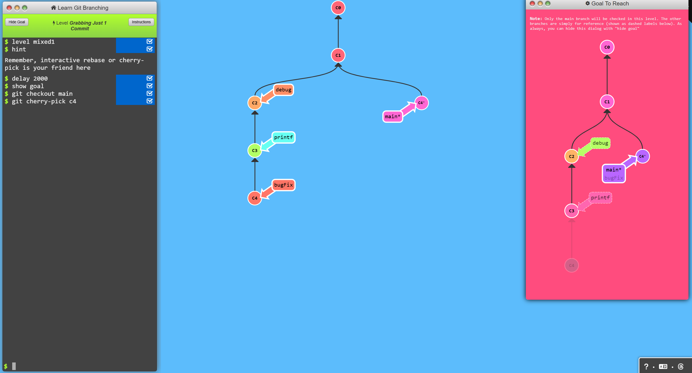
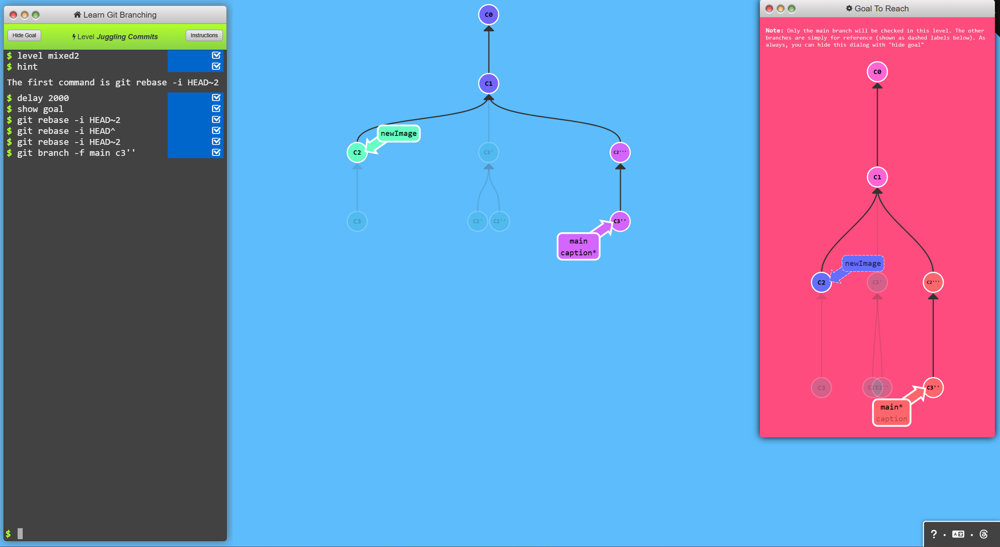
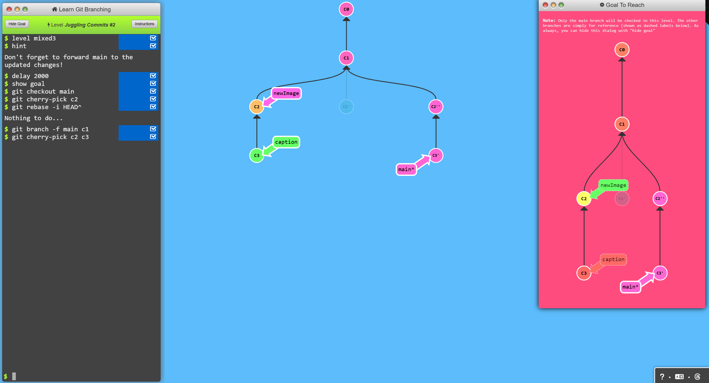
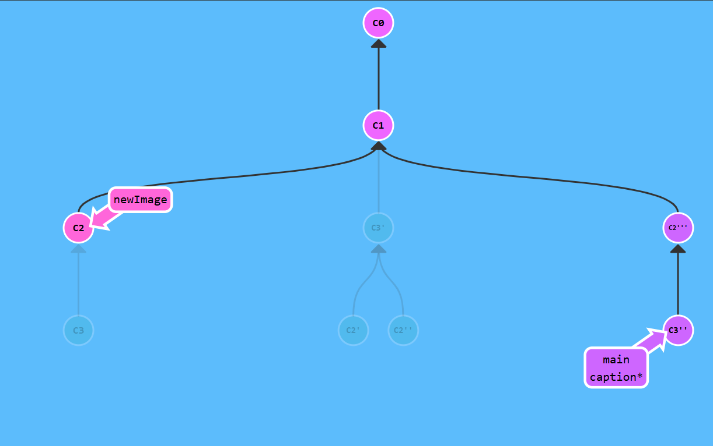
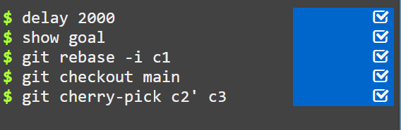

# A Mixed Bag: Advanced Git Techniques

## Level 1: Grabbing Just One Commit
Sometimes, we need to copy only a single commit from our history. To achieve this, we can use the following Git commands:

- `git rebase -i`
- `git cherry-pick`

### Command
```bash
$ git checkout main
$ git cherry-pick c4
```

### Result


---

## Level 2: Juggling Commits
A common scenario arises when we need to modify an earlier commit. For example, let's say we need to tweak an image dimension from an older commit. Here’s how we can handle it:

1. Reorder commits to bring the one we want to modify to the top using `git rebase -i`.
2. Modify the commit with `git commit --amend`.
3. Reorder the commits back to their original sequence using `git rebase -i`.
4. Move `main` to the updated commit tree to finalize the process.

### Command
```bash
$ git rebase -i HEAD~2
$ git rebase -i HEAD^
$ git rebase -i HEAD~2
$ git branch -f main c3''
```

### Result


---

## Level 3: Juggling Commits #2
While `git rebase -i` is useful, too much reordering can lead to conflicts. An alternative method is using `git cherry-pick` to apply a commit from anywhere in the tree onto `HEAD` (as long as it isn’t an ancestor of `HEAD`).

### Command
```bash
$ git checkout main
$ git cherry-pick c2
$ git rebase -i HEAD^
$ git branch -f main c1
$ git cherry-pick c2 c3
```

### Result


---

## Level 4: Git Tags
When working on a project, we might want to mark important milestones like major releases or merges. Git provides `tags` as a way to permanently mark these points in history.

### Command
```bash
$ git tag v0 c1
$ git tag v1 c2
$ git checkout c2
```

### Result


---

## Level 5: Git Describe
Tags serve as great reference points in our repository. Git provides the `git describe` command, which shows where we are relative to the closest tag.

### Command
```bash
$ git describe main
v0_2_gC2
$ git describe side
v1_1_gC4
$ git commit
```

### Result
