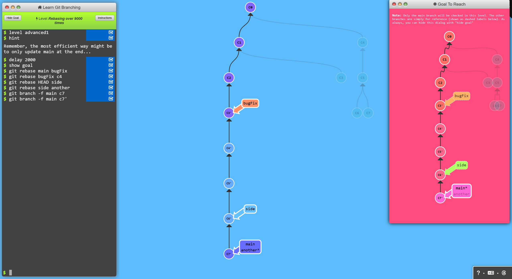
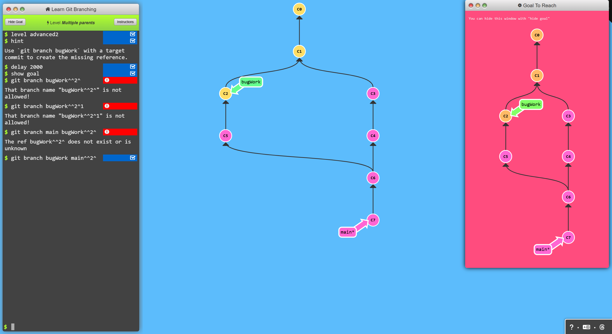

# Advanced Topics

## Level 1: Rebasing Over 9000 Times
Managing multiple branches can be tricky! Let’s rebase all the work from these branches onto `main`.

### Command
```bash
$ git rebase main bugFix
$ git rebase bugFix c4
$ git rebase HEAD side
$ git rebase side another
$ git branch -f main c7'
```

### Result


---

## Level 2: Multiple Parents
Like the `~` modifier, the `^` modifier also accepts an optional number after it.

Rather than specifying the number of generations to go back (as `~` does), the `^` modifier specifies which parent reference to follow from a merge commit. Since merge commits have multiple parents, the path to choose can be ambiguous.

Git will normally follow the "first" parent upwards from a merge commit, but specifying a number with `^` changes this default behavior.

### Command
```bash
$ git branch bugWork main^^2^
```

### Result


---

## Level 3: Branch Spaghetti
We have quite a challenge in this level! 

Here, `main` is a few commits ahead of branches `one`, `two`, and `three`. For some reason, we need to update these three branches with modified versions of the last few commits on `main`:

- **Branch one**: Needs a re-ordering of those commits and the exclusion of `C5`.
- **Branch two**: Requires a pure reordering of the commits.
- **Branch three**: Needs only one commit transferred.

### Command
```bash
$ git checkout one
$ git cherry-pick c4 c3 c2
$ git checkout two
$ git cherry-pick c5 c4 c3 c2
$ git branch -f three c2
```

### Result


