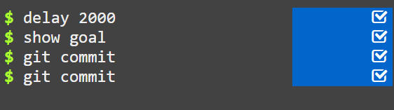
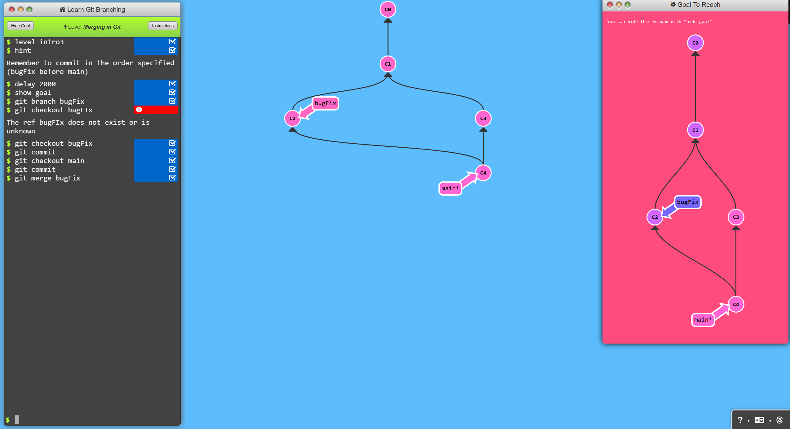
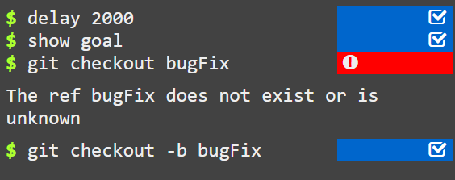
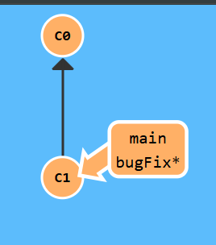
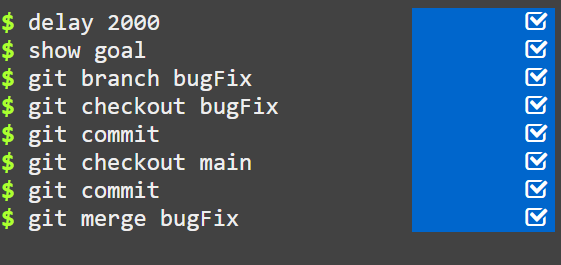
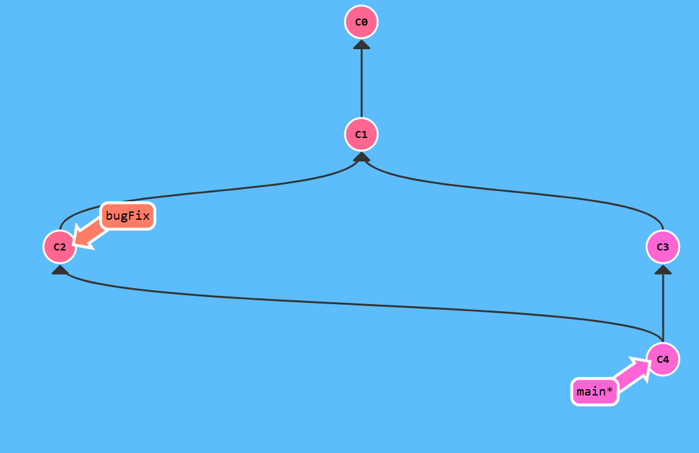
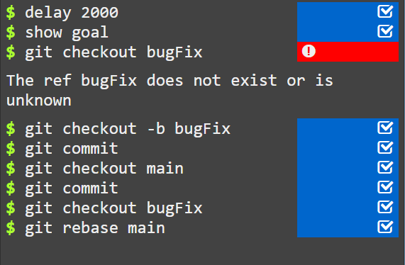
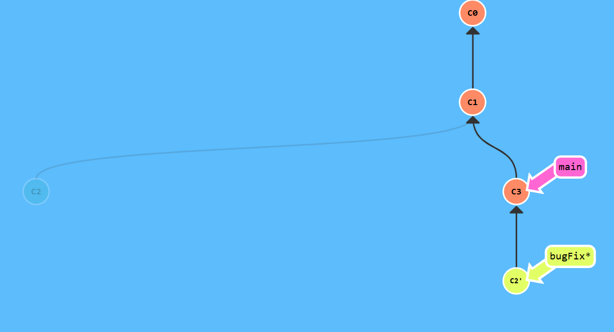

# Introduction to Git

Welcome to the Git Introduction Sequence! This guide will walk you through the fundamental concepts of Git, including committing, branching, merging, and rebasing.

---

## Level 1: Introduction to Git Commits
A commit in a Git repository records a snapshot of all the tracked files in your directory. Think of it as a "save point" in your project's history.

### Commands

### Result

---

## Level 2: Branching in Git
Branches in Git are lightweight pointers to specific commits. This makes working on multiple features or bug fixes seamless and efficient.

> **Best Practice**: *Branch early, and branch often!*

### Commands

### Result

---

## Level 3: Merging in Gits
Now that we can commit and branch, it's time to learn how to combine changes from different branches. Merging allows us to develop features separately and then integrate them back into the main branch.

### Commands

### Result

---

## Level 4: Rebasing introduction
Rebasing replays commits from one branch onto another, creating a cleaner and more linear commit history.

### Commands

### Result

