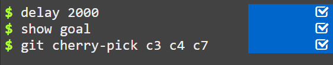

# Moving Work Around

## Level 1: Cherry-Pick Intro
The first command in this series is called `git cherry-pick`. It takes on the following form:

```
git cherry-pick <Commit1> <Commit2> <...>
```

This command allows you to copy a series of commits below your current location (`HEAD`). Cherry-picking is useful when you need to apply specific changes from one branch to another.

### Commands


### Result


---

## Level 2: Interactive Rebase Intro
Interactive rebase (`git rebase -i`) provides a way to rewrite commit history by allowing you to edit, squash, or reorder commits before applying them.

When you run an interactive rebase, Git opens a UI (often in a text editor like Vim), displaying the list of commits and allowing you to choose how to modify them.

### Commands


### Result

