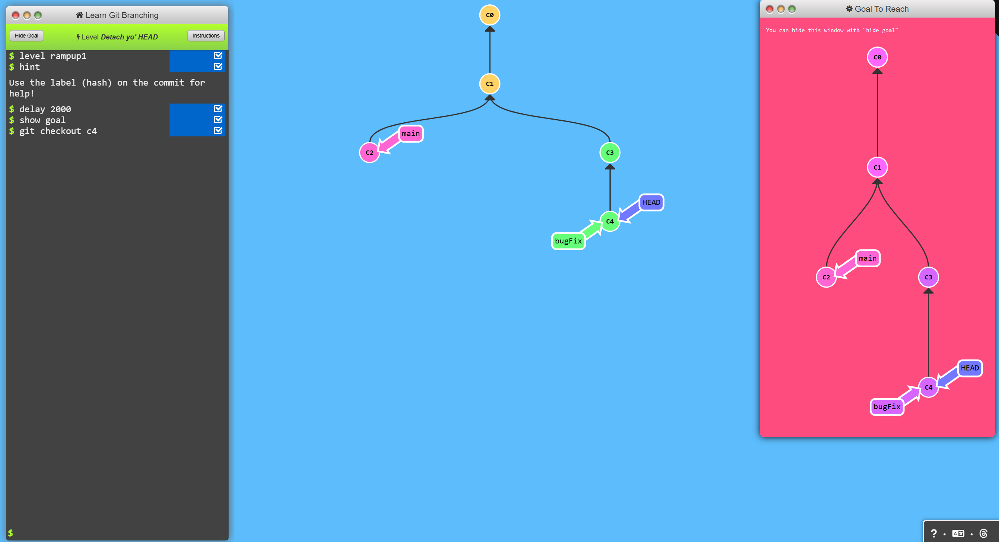

# Ramping Up

## Level 1: Detached yo' HEAD
Before we get to some of the more advanced features of Git, it's important to understand different ways to move through the commit tree that represents your project.

### Commands
```bash
$ git checkout c4
```

### Result


---

## Level 2: Relative Refs (^)
With relative refs, you can start somewhere memorable (like the branch `bugFix` or `HEAD`) and work from there.

Relative commits are powerful, but we will introduce two simple ones here:

- Moving upwards one commit at a time with `^`
- Moving upwards a number of times with `~<num>`

### Commands
```bash
$ git checkout c4
$ git checkout HEAD^
```

### Result


---

## Level 3: Relative Refs #2 (~)
The `~` operator  
If you want to move up multiple levels in the commit tree, it might be tedious to type `^` multiple times. Git provides the tilde `~` operator, which allows you to ascend a specified number of commits.

### Commands
```bash
$ git branch -f main c6
$ git checkout HEAD~
$ git branch -f bugFix c0
```

### Result


---

## Level 4: Reversing Changes in Git
There are many ways to reverse changes in Git. Just like committing, reversing changes has both a low-level component (staging individual files or chunks) and a high-level component (how the changes are actually reversed). Our focus will be on the latter.

There are two primary ways to undo changes in Git:

- Using `git reset`
- Using `git revert`

### Commands
```bash
$ git reset HEAD~1
$ git checkout pushed
$ git revert HEAD
```

### Result


