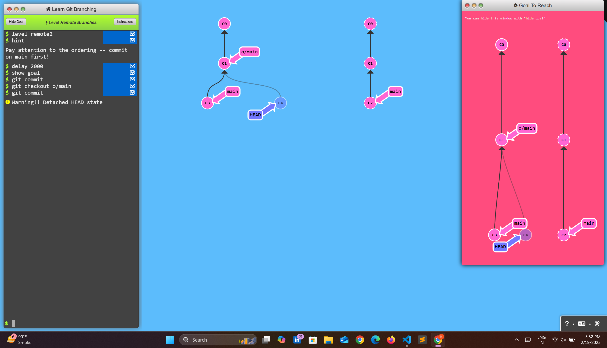
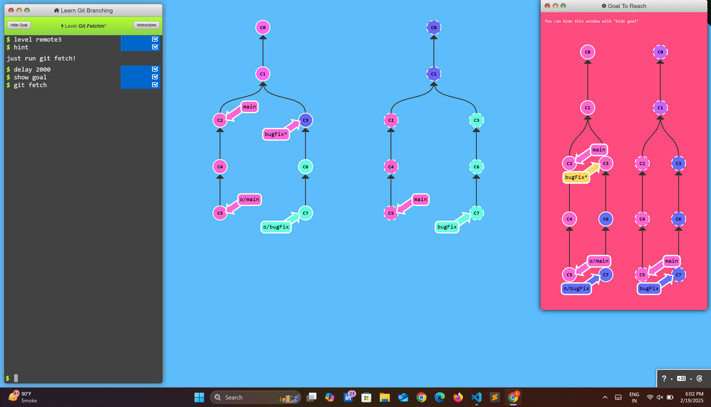
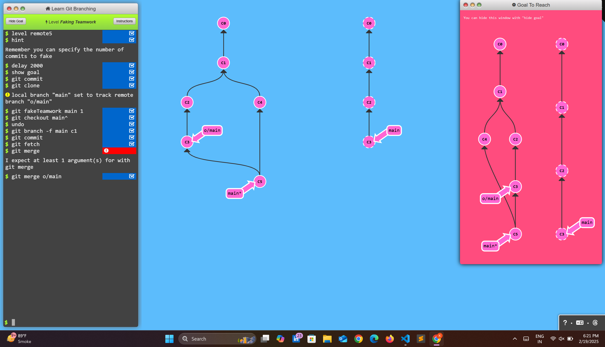
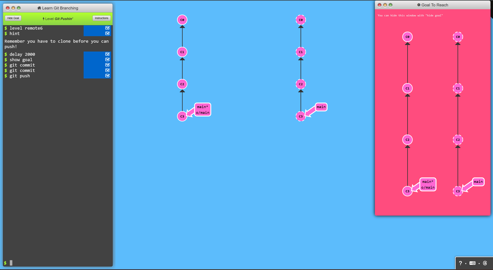
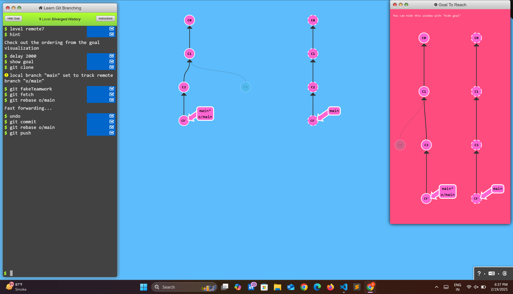
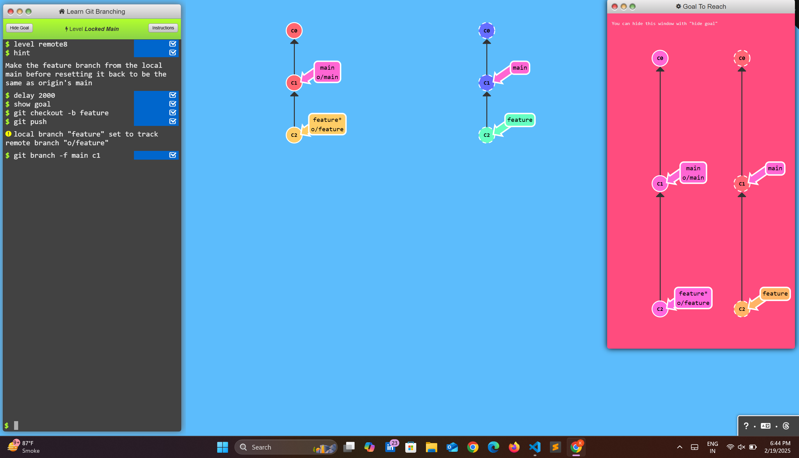

# Push & Pull -- Git Remotes!

## Level - 1 : Clone Intro

### Commands
```bash
$ git clone
```
### Result


---

## Level - 2 : Remote Branches

### Commands
```bash
$ git commit
$ git checkout o/main
$ git commit
```
### Result


---
## Level - 3 : Git Fetchin'

### Commands
```bash 
$ git fetch
```
### Result

---

## Level - 4 : Git pullin'

### Commands
```bash
$ git pull
```
### Result

---

## Level - 5 : Faking Teamwork

### Commands
```bash
$ git commit
$ git clone
local branch "main" set to track remote branch "o/main"
$ git fakeTeamwork main 1
$ git branch -f main c1
$ git commit
$ git fetch
$ git merge o/main
```
### Result

---

## Level - 6 : Git Pushin'

### Commands
```bash
$ git commit
$ git commit
$ git push
```
### Result

---

## Level - 7 : Diverged History

### Commands
```bash
$ git clone
local branch "main" set to track remote branch "o/main"
$ git fakeTeamwork
$ git fetch
$ git commit
$ git rebase o/main
$ git push
```
### Result

---


## Level - 8 : Locked Main

### Commands
```bash
$ git checkout -b feature
$ git push
local branch "feature" set to track remote branch "o/feature"
$ git branch -f main c1
```
### Result
