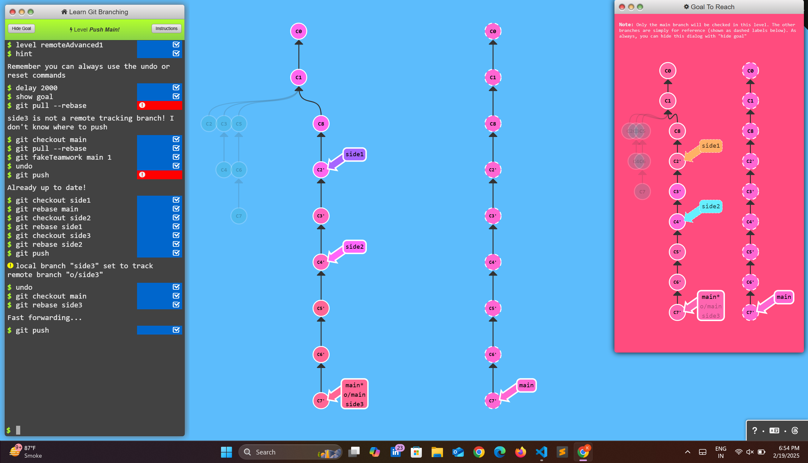
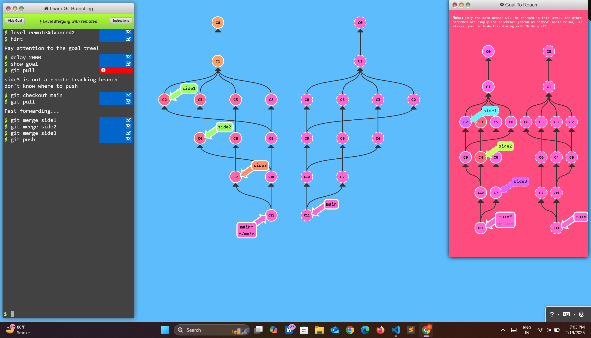
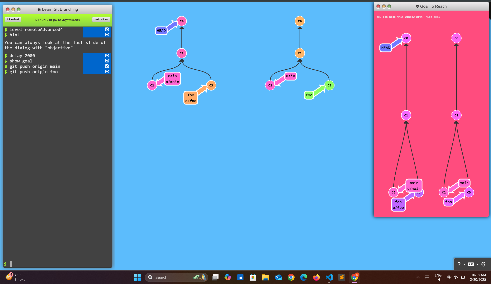
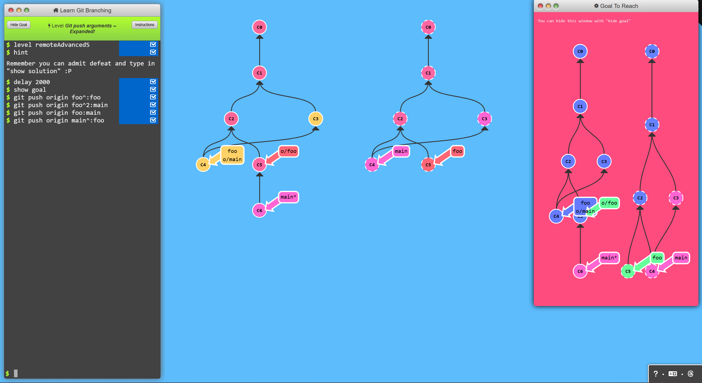
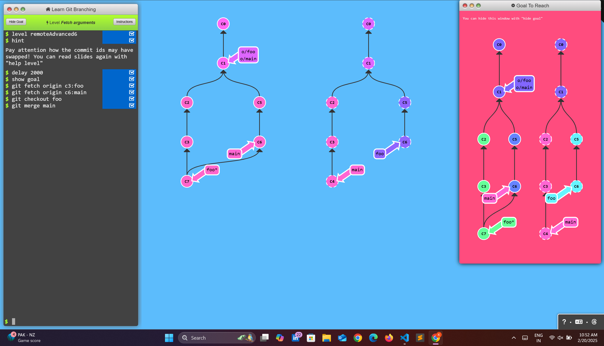
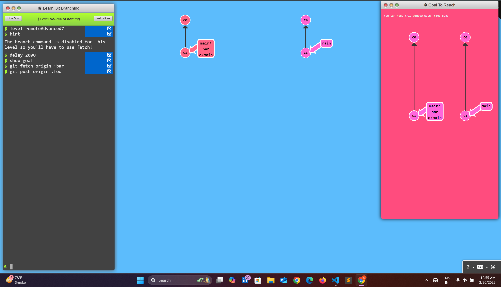
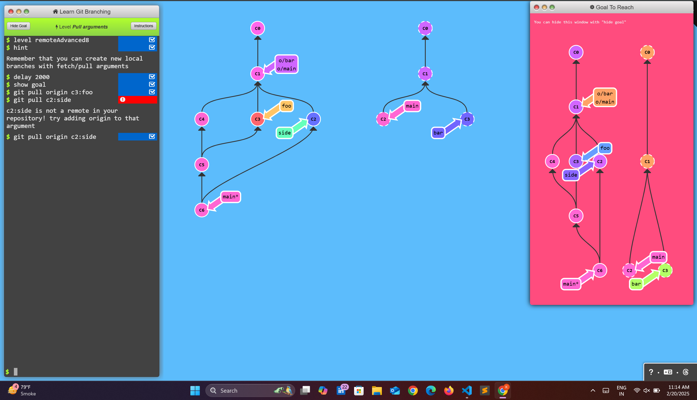

# To Origin And Beyond -- Advanced Git Remotes!

## Level - 1 : Push Main


### Commands
```bash
$ git checkout main
$ git pull --rebase
$ git checkout side1
$ git rebase main
$ git checkout side2
$ git rebase side1
$ git checkout side3
$ git rebase side2
$ git checkout main
$ git rebase side3
$ git push
```

### Result


---

## Level - 2 : Merging With remotes

### Commands
```bash
$ git pull
$ git checkout main
$ git pull
$ git merge side1
$ git merge side2
$ git merge side3
$ git push
```

### Result


---

## Level - 3 : Remote Tracking

### Commands
```bash
$ git checkout -b side o/main
local branch "side" set to track remote branch "o/main"
$ git commit
$ git fetch
$ git rebase c2
$ git push
```
### Result


---

## Level - 4 : Git push Arguments

### Commands
```bash
$ git push origin main
$ git push origin foo
```
### Result


---

## Level - 5 : Git push Arguments - Expanded

### Commands
```bash
$ git push origin foo^:foo
$ git push origin foo^2:main
$ git push origin foo:main
$ git push origin main^:foo
```
### Result


---

## Level - 6 : Fetch Argument

### Commands
```bash
$ git fetch origin c3:foo
$ git fetch origin c6:main
$ git checkout foo
$ git merge main
```
### Result


---

## Level - 7 : Source of nothing 

### Commands
```bash
$ git fetch origin :bar
$ git push origin :foo
```
### Result


---

## Level - 8 : Pull Arguments

### Commands
```bash
$ git pull origin c3:foo
$ git pull origin c2:side
```
### Result
